# WSHawk Desktop v3 — Complete Reference Guide

> **Version 3.0.1** · Author: Regaan ([@noobforanonymous](https://github.com/noobforanonymous))
> Advanced WebSocket & Web Application Security Scanner

---

## Table of Contents

1. [Overview](#overview)
2. [Architecture](#architecture)
3. [Installation & Setup](#installation--setup)
4. [Operating Modes](#operating-modes)
5. [Standard Mode](#standard-mode)
6. [Advanced Mode](#advanced-mode)
7. [Web Pentest Mode](#web-pentest-mode)
8. [Cross-Cutting Features](#cross-cutting-features)
9. [Backend API Reference](#backend-api-reference)
10. [Engine Reference](#engine-reference)
11. [Database & Persistence](#database--persistence)
12. [Keyboard Shortcuts](#keyboard-shortcuts)
13. [Configuration](#configuration)
14. [Build & Distribution](#build--distribution)
15. [Troubleshooting](#troubleshooting)

---

## Overview

WSHawk Desktop is an Electron-based security assessment platform that combines WebSocket-specific vulnerability scanning with a full-spectrum web penetration testing toolkit. The desktop application wraps the WSHawk Python engine in a native window, providing real-time streaming results, interceptor proxying, and persistent scan history through a professional dark-themed interface.

The application ships with **22+ integrated security tools** organized across three operating modes, a real-time WebSocket MitM interceptor, an adaptive payload mutation engine, and a SQLite-backed scan history system with vulnerability diff tracking.

### Key Capabilities

- Heuristic WebSocket vulnerability scanning (SQLi, XSS, CMDi, XXE, NoSQLi, SSRF, path traversal)
- Smart Payload Engine with genetic algorithm-based payload evolution
- Full-duplex WebSocket interception and modification (Burp-style proxy)
- 22 HTTP security tools (crawler, fuzzer, port scanner, SSL analyzer, WAF detector, and more)
- Multi-step attack chaining with variable extraction and templating
- Automated vulnerability scanning with phase orchestration
- Professional HTML/JSON/PDF report generation
- SQLite scan history with vulnerability regression diffing
- Session save/restore for full state persistence
- Certificate Authority generation for HTTPS interception

---

## Architecture

WSHawk Desktop uses a **dual-process sidecar model** where an Electron frontend communicates with a Python backend server over HTTP and Socket.IO.

```mermaid
graph TB
    subgraph Electron["Electron App"]
        Main["index.js\n(Main Process)"]
        Preload["preload.js\n(Secure Bridge)"]
        Renderer["renderer.js\n(UI Logic — 4,641 lines)"]
        Main -->|IPC| Preload
        Preload -->|contextBridge| Renderer
    end

    Main -->|"Spawns sidecar"| Bridge
    Renderer -->|"REST (fetch)"| Bridge
    Renderer <-->|"Socket.IO\n(real-time events)"| Bridge

    subgraph Backend["Python Backend (Port 8080)"]
        Bridge["gui_bridge.py\n(FastAPI + Socket.IO)"]
        Bridge --> Scanner["scanner_v2.py\n(WebSocket Scanner)"]
        Bridge --> Mutator["payload_mutator.py\n(Mutation Engine)"]
        Bridge --> Discovery["ws_discovery.py\n(Endpoint Finder)"]
        Bridge --> DB["db_manager.py\n(SQLite)"]
        Bridge --> WebPentest["web_pentest/\n(22 HTTP Engines)"]
        Bridge --> SmartPayloads["smart_payloads/\n(SPE Engine)"]
    end

    style Electron fill:#1a1a2e,stroke:#6c63ff,color:#fff
    style Backend fill:#0f3460,stroke:#e94560,color:#fff
```



### Component Breakdown

| Layer | File | Responsibility |
|---|---|---|
| **Main Process** | `desktop/index.js` | Window management, Python sidecar lifecycle, IPC handlers for file dialogs and window controls |
| **Preload Script** | `desktop/preload.js` | Secure IPC bridge via `contextBridge`. Whitelisted channels only — no raw `ipcRenderer` exposure |
| **Renderer** | `desktop/src/renderer.js` | All UI logic (4,641 lines). Socket.IO client, tool panel interactions, real-time result rendering |
| **HTML Shell** | `desktop/src/index.html` | Single-page layout containing all views, modals, and tool panels |
| **Styles** | `desktop/src/style.css` | Dark-mode design system with CSS custom properties and theme support |
| **Backend Bridge** | `wshawk/gui_bridge.py` | FastAPI + Socket.IO server (1,342 lines). All REST endpoints and real-time event emission |
| **Scanner Core** | `wshawk/scanner_v2.py` | WebSocket heuristic scanner (940 lines). 7 injection test suites with smart payload integration |
| **Database** | `wshawk/db_manager.py` | SQLite persistence for scan history, findings, and vulnerability comparison |

### Security Model

The Electron app enforces the following security constraints:

- `contextIsolation: true` — Renderer runs in an isolated JavaScript context
- `nodeIntegration: false` — No direct Node.js access from the renderer
- Preload API uses explicit channel whitelisting:
  - **Send**: `window:minimize`, `window:maximize`, `window:close`
  - **Invoke**: `dialog:openProject`, `dialog:saveProject`, `dialog:exportReport`, `dialog:exportExploit`
  - **Receive**: `scan_update`, `vulnerability_found`, and other scan events

### Communication Protocol


- **REST API** (`fetch` calls to `http://127.0.0.1:8080`): Used for request-response operations (start scan, send request, get payloads, export report)
- **Socket.IO** (persistent connection): Used for streaming real-time data (scan progress, fuzzer results, port discoveries, intercepted frames)
- **IPC** (`ipcMain` / `ipcRenderer`): Used for Electron-native operations (file dialogs, window controls)

---

## Installation & Setup

### Prerequisites

- **Node.js** 18+ and npm
- **Python** 3.9+ with pip
- **Git** (for cloning from source)

### From Source

```bash
git clone https://github.com/noobforanonymous/wshawk
cd wshawk

# Install Python dependencies
pip install -e .

# Install Electron dependencies
cd desktop
npm install

# Launch the application
npm start
```

### Python Dependencies

The backend requires the following Python packages:

```
fastapi
uvicorn
python-socketio
websockets
aiohttp
dnspython
python-whois
cryptography
pyyaml
```

Install all at once:

```bash
pip install fastapi uvicorn python-socketio websockets aiohttp dnspython python-whois cryptography pyyaml
```

### First Launch

On first launch, WSHawk will:

1. Check for a valid Python installation (`python3 --version`)
2. Verify required Python packages are installed
3. Spawn the backend bridge on port 8080
4. Display a one-time Terms of Service agreement
5. Connect the renderer to the backend via Socket.IO

The status bar at the bottom of the window shows the connection state. A green indicator confirms the backend is running.

---

## Operating Modes

WSHawk Desktop has three operating modes, each progressively revealing more tools. Toggle between them using the mode button in the header.

| Mode | Badge | Tools Available |
|---|---|---|
| **Standard** | 🟦 STANDARD | Dashboard, Request Forge, Findings, Traffic History, System Log |
| **Advanced** | 🟧 ADVANCED | Standard + Payload Blaster, Interceptor, Endpoint Map, Auth Builder, Mutation Lab, Scheduler, Codec, Comparer, Notes |
| **Web** | 🟣 WEB PENTEST | Advanced + All 22 HTTP security tools |

---

## Standard Mode

### Dashboard & Heuristic Scanner

The dashboard is the primary entry point for WebSocket security assessments.

**Usage:**
1. Enter a `ws://` or `wss://` target URL
2. Optionally provide an authentication payload (sent immediately after connection)
3. Click **Start Scan**

**Backend Route:** `POST /scan/start`

**Engine:** `WSHawkV2` (scanner_v2.py)

The scanner performs a learning phase to understand the target's message protocol, then runs seven test suites sequentially:


| Test Suite | Method | Detection Technique |
|---|---|---|
| SQL Injection | `test_sql_injection_v2()` | Error-based, time-based (SLEEP/WAITFOR), boolean-based |
| Cross-Site Scripting | `test_xss_v2()` | Reflection analysis, context detection, DOM sink identification |
| Command Injection | `test_command_injection_v2()` | Timing attacks, command chaining (`&&`, `|`, `;`) |
| Path Traversal | `test_path_traversal_v2()` | File content markers (`/etc/passwd`, `win.ini`) |
| XML External Entity | `test_xxe_v2()` | Entity expansion, OAST callback detection |
| NoSQL Injection | `test_nosql_injection_v2()` | MongoDB operator injection (`$gt`, `$ne`, `$regex`) |
| Server-Side Request Forgery | `test_ssrf_v2()` | Internal IP probing, cloud metadata access |

Each test integrates with the **Smart Payload Engine**:
- **Context Generator** — Detects message format (JSON, XML, plaintext) and generates payloads matching the expected schema
- **Feedback Loop** — Adapts strategy based on server signals (errors, reflections, timing anomalies, WAF blocks)
- **Payload Evolver** — Genetic algorithm that crossovers and mutates successful payloads to discover bypasses

Progress is streamed via `scan_update` and `vulnerability_found` Socket.IO events.

### Request Forge

Manual WebSocket message crafting tool for targeted testing.

**Backend Route:** `POST /reqforge/send`

Enter a payload, send it to the target, and view the raw response. The connection is opened fresh for each request with a 120-second receive timeout.

**Regex Extractor** — A sub-panel that applies named capture group regex patterns against responses to extract tokens, session IDs, or other values for use in subsequent requests.

### Findings Panel

Displays all discovered vulnerabilities as severity-tagged cards.

Each finding includes:
- **Severity badge** (HIGH / MEDIUM / LOW / INFO)
- **Vulnerability type** and description
- **Copy** button — Copies finding details to clipboard
- **Export PoC** button — Generates a complete standalone Python exploit script using `asyncio` and `websockets` that reproduces the vulnerability

Findings are searchable by keyword and filterable by severity level.

### Traffic History

A chronological log of every WebSocket frame sent and received during the session.

Each entry shows:
- Direction (→ sent / ← received)
- Timestamp
- Payload size
- Message content

Each row has a **→ Forge** button that copies the payload into Request Forge for replay or modification.

### System Log

Timestamped, terminal-style event log showing all backend activity — scan phases, connections, errors, and result summaries. Color-coded by severity (info, warning, error).

---

## Advanced Mode

### Payload Blaster

High-speed WebSocket fuzzing engine for bulk payload testing.

**Backend Routes:** `POST /blaster/start`, `GET /blaster/payloads/{category}`, `POST /blaster/stop`

**Payload Categories:**

| Category ID | Description |
|---|---|
| `sqli_all` | Complete SQL injection payload set |
| `sqli_time` | Time-based blind SQLi (SLEEP, WAITFOR, BENCHMARK) |
| `sqli_error` | Error-based SQLi (UNION, SELECT) |
| `sqli_boolean` | Boolean-based blind SQLi |
| `xss_all` | Full XSS payload set |
| `xss_ws` | WebSocket-specific XSS (onmessage, javascript:) |
| `cmd` | OS command injection |
| `nosql` | NoSQL injection (MongoDB operators) |
| `lfi` | Local File Inclusion / path traversal |
| `ssti` | Server-Side Template Injection |
| `xxe` | XML External Entity |

**Features:**
- Template support with `§inject§` marker for payload insertion into structured messages
- **Smart Payload Engine** toggle — When enabled, 70% of payloads are mutated via `PayloadEvolver._mutate()` before sending
- **Response diff detection** — First response becomes the baseline; subsequent responses show `+/- N bytes` differences highlighted for anomaly detection
- 500ms rate limiting between payloads
- Authentication payload support (sent before fuzzing begins)

Results streamed via `blaster_progress` → `blaster_result` → `blaster_completed` events.

### Interceptor

Real-time WebSocket frame interception proxy, functionally similar to Burp Suite's WebSocket interception.

**Backend Routes:** `POST /interceptor/toggle`, `POST /interceptor/action`, `WebSocket /proxy`

**How it works:**


1. The renderer connects to `ws://127.0.0.1:8080/proxy?url=<target>` instead of the target directly
2. The backend opens a connection to the real target
3. Two async coroutines relay frames bidirectionally (`client_to_target`, `target_to_client`)
4. When interception is **ON**, each frame creates an `asyncio.Future` in the interception queue
5. The frame payload is emitted to the UI via `intercepted_frame`
6. The backend **awaits** the Future until the user takes action

**User Actions:**
- **Forward** — Relay the frame (optionally modified) to its destination
- **Drop** — Silently discard the frame
- **Edit** — Modify the payload before forwarding

When interception is toggled OFF, all pending futures are resolved with `drop` action and the queue is cleared.

### WebSocket Endpoint Map

Automated WebSocket endpoint discovery for a target domain.

**Backend Routes:** `POST /discovery/scan`, `POST /discovery/probe`

**Engine:** `WSEndpointDiscovery` (ws_discovery.py, 489 lines)

**Discovery Techniques:**
1. HTTP Upgrade header probing on 20+ common WebSocket paths (`/ws`, `/websocket`, `/socket.io`, `/graphql`, etc.)
2. HTML page crawling for `ws://` and `wss://` URL patterns
3. JavaScript source analysis for `new WebSocket()` constructor calls and configuration objects

Results are grouped by domain in a tree view. Each endpoint shows:
- Full URL
- Confidence level (HIGH / MEDIUM / LOW)
- Discovery source (upgrade probe, HTML, JavaScript)

**Actions per endpoint:**
- **Probe** — Test connectivity with a 5-second WebSocket handshake
- **Attack** — Auto-fills the dashboard target URL and switches to scan mode

### Auth Builder

Multi-step authentication sequence constructor for WebSocket targets that require login.

**Backend Route:** `POST /auth/test`

Define ordered steps:

| Action | Behavior |
|---|---|
| `send` | Send a message and capture the response |
| `wait` | Pause for a specified duration (ms) |

**Extraction Rules** — Regex patterns applied against responses to capture values. Extracted tokens are stored as `§tokenName§` variables and automatically substituted into subsequent step payloads.

Supports saving and loading authentication presets for repeated use against the same target.

### Payload Mutation Lab

Generates mutated variants of a base payload using multiple bypass strategies.

**Backend Route:** `POST /mutate`

**Engine:** `PayloadMutator` (payload_mutator.py, 448 lines)

**Mutation Strategies:**

| Strategy | Enum Value | Technique |
|---|---|---|
| Case Variation | `CASE_VARIATION` | Random upper/lower case permutations |
| Encoding | `ENCODING` | URL, Base64, Hex, HTML entity, Unicode encoding; double-encoding combinations |
| Comment Injection | `COMMENT_INJECTION` | Insert `/**/`, `<!--`, and similar comment sequences at random positions |
| Whitespace | `WHITESPACE` | Tab, newline, null byte, and zero-width character insertion |
| Concatenation | `CONCATENATION` | String splitting with `'+'`, `CONCAT()`, `CHAR()` |
| Bypass Filter | `BYPASS_FILTER` | Null bytes, Unicode normalization, alternative representations |
| Tag Breaking | `TAG_BREAKING` | Alternative HTML tags (``, `<svg>`, `<details>`, `<marquee>`) |
| Polyglot | `POLYGLOT` | Multi-context payloads effective in HTML, JS, and SQL simultaneously |

The engine uses a **weighted scoring system**. `learn_from_response()` adjusts strategy weights based on WAF blocks, timing anomalies, and successful reflections. `generate_adaptive_payloads()` uses these weights to select the optimal strategy mix automatically.

The UI tries the backend SPE engine first; if unavailable, falls back to client-side JavaScript mutations.

### Scheduler

Automated recurring scan scheduler.

Configure scans at intervals:
- Every 1 hour, 6 hours, 12 hours, 24 hours, or weekly

The scheduler tracks **vulnerability deltas** between runs, showing "+N new" or "-N resolved" vulnerabilities compared to the previous run. Active schedules auto-resume on application restart via localStorage persistence.

### Codec (Encoder/Decoder)

Comprehensive encoding and hashing toolkit.

**Encoding Operations:**
- Base64 encode/decode
- URL encode/decode
- HTML entity encode/decode
- Hex encode/decode
- Unicode escape encode/decode
- Gzip decompress (accepts base64-encoded input)

**Hashing Operations:**
- MD5 (pure JavaScript implementation)
- SHA-1, SHA-256, SHA-512 (via Web Crypto API / SubtleCrypto)

**Smart Decode** — Recursively peels encoding layers from an input string, displaying each transformation step in the decode chain until the plaintext is reached.

### Comparer

Side-by-side response diffing tool.

Paste two responses into the left and right panels. The tool performs line-by-line comparison and highlights:
- Lines present only in the left response (`-`)
- Lines present only in the right response (`+`)
- Byte size delta between the two responses

### Notes

Persistent notepad with automatic localStorage save.

- Title auto-updates from the first line of the note
- **Link Findings** button appends all current vulnerability findings to the note
- Notes persist across application restarts

---

## Web Pentest Mode

The Web Pentest mode adds 22 HTTP-based security tools organized into six phases. Each tool communicates with a dedicated Python engine class in the `wshawk/web_pentest/` package.

### Phase 1: Core Tools

#### HTTP Forge
Manual HTTP request builder supporting GET, POST, PUT, DELETE, PATCH, HEAD, and OPTIONS methods. Requests are routed through the Python backend to bypass browser CORS restrictions. Displays response status, headers, body, and timing.

**Route:** `POST /web/request` · **Engine:** `WSHawkHTTPProxy` (82 lines)

#### HTTP Fuzzer
Parameter fuzzing with `§FUZZ§` position markers. Replaces markers in URL, body, or headers with entries from built-in or custom wordlists. Supports URL/Base64/Hex encoding per payload. Includes regex grep matching on responses and heuristic detection for SQLi errors, XSS reflection, LFI markers, and command injection patterns.

**Route:** `POST /web/fuzz` · **Engine:** `WSHawkFuzzer` (300 lines) · **Streaming:** `fuzz_result` events

#### Directory Scanner
Asynchronous directory and file brute-forcer. Default wordlist of 25 common paths with extension permutation (php, html, js, txt, json, bak). Supports custom wordlists up to 50,000 entries, configurable throttling for WAF evasion, and recursive scanning into discovered directories. 10-20 concurrent workers with semaphore control.

**Route:** `POST /web/dirscan` · **Engine:** `WSHawkDirScanner` (179 lines) · **Streaming:** `dir_result`, `dir_done` events

#### Header Analyzer
Evaluates seven HTTP security headers and assigns risk ratings:

| Header | Safe Example | Risk When Missing/Weak |
|---|---|---|
| Strict-Transport-Security | `max-age=31536000; includeSubDomains` | Medium |
| Content-Security-Policy | No `unsafe-inline` or `*` | Medium |
| X-Frame-Options | `DENY` or `SAMEORIGIN` | Medium |
| X-Content-Type-Options | `nosniff` | Medium |
| Server | Not disclosed | Low (info leak) |
| X-Powered-By | Not disclosed | Low (info leak) |
| Access-Control-Allow-Origin | Specific origin | High if `*` |

**Route:** `POST /web/headers` · **Engine:** `WSHawkHeaderAnalyzer` (70 lines)

#### Subdomain Finder
Multi-source subdomain enumeration with concurrent queries to **crt.sh** (Certificate Transparency logs) and **AlienVault OTX** (passive DNS). Optional active brute-force with 32 common prefixes and DNS resolution validation with 50-connection concurrency. Includes a **Workflow** button that pipes discovered subdomains into the Directory Scanner.

**Route:** `POST /web/subdomains` · **Engine:** `WSHawkSubdomainFinder` (143 lines)

### Phase 2: Automation

#### Web Crawler
BFS web spider with configurable depth and page limits. Discovers pages, forms, script sources, and API-like endpoints. Parses `robots.txt` and `sitemap.xml`. Has a **Crawl + Sensitive Data** toggle that chains the crawler output into the Sensitive Data Finder for comprehensive coverage.

**Route:** `POST /web/crawl`, `POST /web/crawl-sensitive` · **Engine:** `WSHawkCrawler` (257 lines)

#### Vulnerability Scanner
Automated multi-phase vulnerability assessment orchestrator. Chains five engines in sequence:

```mermaid
graph TB
    A["Phase 1: Crawl"] -->|"Discovered pages"| B["Phase 2: Header Analysis"]
    B -->|"Security header findings"| C["Phase 3: Directory Scan"]
    C -->|"Hidden paths found"| D["Phase 4: Fuzz"]
    D -->|"Parameter injection results"| E["Phase 5: Sensitive Data Scan"]
    E --> F["Final Report"]

    D -->|"SQLi confirmed?"| G["Auto-escalate → LFI"]
    G --> F

    style A fill:#16213e,stroke:#0f3460,color:#fff
    style F fill:#1a1a2e,stroke:#e94560,color:#fff
    style G fill:#533483,stroke:#e94560,color:#fff
```



Phase badges in the UI light up as each phase starts and completes. Contains auto-escalation logic — if SQL injection is confirmed, the scanner automatically attempts LFI escalation. Results are displayed with a canvas-drawn severity donut chart and saved to the SQLite database.

**Route:** `POST /web/vulnscan`, `POST /web/vulnscan/stop` · **Engine:** `WSHawkVulnScanner` (453 lines)

#### Report Generator
Produces self-contained security assessment reports.

| Format | Method | Description |
|---|---|---|
| HTML | `generate_html()` | Print-ready report with executive summary, severity charts, findings table, and remediation guidance |
| JSON | `generate_json()` | Structured data export |
| PDF | `generate_pdf()` | HTML-to-PDF conversion via WeasyPrint |

**Route:** `POST /web/report` · **Engine:** `WSHawkReportGenerator` (639 lines)

### Phase 3: Recon & Intelligence

#### Tech Fingerprinter
Identifies server technologies by matching HTTP headers, cookies, response body content, and `<meta generator>` tags against a signature database of 35+ technologies. Detections are categorized (Server, Framework, CMS, JS Library, Analytics, CDN, Security) with confidence levels based on the number of matching sources.

**Route:** `POST /web/fingerprint` · **Engine:** `WSHawkTechFingerprinter` (176 lines)

#### SSL/TLS Analyzer
Inspects certificate details (subject, issuer, SAN, serial number, expiry, cipher suite) and tests protocol version support (TLS 1.0 through 1.3). Detects expired certificates, weak ciphers (<128-bit), self-signed certificates, and deprecated protocol support. All blocking SSL operations run in thread pool via `asyncio.to_thread()`.

**Route:** `POST /web/ssl` · **Engine:** `WSHawkSSLAnalyzer` (194 lines)

#### Sensitive Data Finder
Scans web page content for 30+ types of leaked secrets using regex patterns. Detections include AWS access keys, Google API keys, GitHub tokens, Slack webhooks, private keys, JWTs, database connection strings, internal IP addresses, and credential patterns. Each finding is assigned a severity level.

**Route:** `POST /web/sensitive` · **Engine:** `WSHawkSensitiveFinder` (151 lines)

### Phase 4: Offensive Tools

#### WAF Detector
Identifies Web Application Firewalls through passive header/cookie/body analysis and active probing with malicious payloads. Signature database covers 15+ WAFs including Cloudflare, AWS WAF, Akamai, Imperva, Sucuri, ModSecurity, and F5 BIG-IP. Reports blocked status and evidence log.

**Route:** `POST /web/waf` · **Engine:** `WSHawkWAFDetector` (221 lines)

#### CORS Tester
Tests for CORS misconfigurations by sending six crafted Origin headers: arbitrary external origin, null origin, subdomain suffix attack, domain prefix injection, subdomain reflection, and HTTP downgrade. Checks whether `Access-Control-Allow-Origin` reflects each origin and whether `Access-Control-Allow-Credentials` is set to `true` (the most critical misconfiguration).

**Route:** `POST /web/cors` · **Engine:** `WSHawkCORSTester` (173 lines)

#### Port Scanner
Asynchronous TCP connect scanner with preset port lists (top-100, web, database, full 1-1024) and custom port range support (`80,443,8000-8100`). Service identification via 30+ port-to-service mapping. Banner grabbing reads the first 256 bytes from open ports. 100-connection semaphore for concurrency control. Capped at 10,000 ports per scan.

**Route:** `POST /web/portscan` · **Engine:** `WSHawkPortScanner` (213 lines) · **Streaming:** `port_found`, `portscan_done` events

#### DNS / WHOIS Lookup
Full DNS record resolution using dnspython for 9 record types (A, AAAA, MX, NS, TXT, CNAME, SOA, SRV, CAA). Reverse DNS via PTR lookup. WHOIS registration data via python-whois with parsed fields (registrar, creation/expiry dates, name servers, status, organization, country, DNSSEC). All three queries execute concurrently.

**Route:** `POST /web/dns` · **Engine:** `WSHawkDNSLookup` (230 lines)

### Phase 5: Exploit & Validation

#### CSRF Forge
Generates Cross-Site Request Forgery proof-of-concept HTML pages. Analyzes the request to select the appropriate PoC type:
- **Auto-submitting HTML form** for form-encoded POST requests
- **Fetch API XHR** for JSON API endpoints
- **Multipart form** for file upload endpoints

Detects existing CSRF protections (SameSite cookies, X-CSRF-Token headers, `_token` body parameters) and generates appropriate warnings. Reports exploitability status.

**Route:** `POST /web/csrf` · **Engine:** `WSHawkCSRFForge` (289 lines)

#### Blind Probe (SSRF)
Tests URL parameters for Server-Side Request Forgery with 40+ payloads across four categories:
- **Cloud Metadata** — AWS, GCP, Azure, DigitalOcean metadata endpoints
- **Internal Services** — localhost, admin panels, database ports
- **DNS Rebinding** — nip.io, localtest.me, .localhost TLD
- **Bypass Techniques** — URL parser confusion, authority confusion, CRLF injection

Auto-detects URL-like parameters. Checks responses against 15+ SSRF success indicators.

**Route:** `POST /web/ssrf` · **Engine:** `WSHawkBlindProbe` (258 lines) · **Streaming:** `ssrf_finding` events

#### Redirect Hunter
Scans URL parameters for Open Redirect vulnerabilities with 25+ redirect payloads including absolute URLs, protocol-relative, backslash tricks, encoded slashes, JavaScript URIs, data URIs, null bytes, and Unicode variations. Auto-detects 20+ common redirect parameter names (`url`, `redirect`, `next`, `return_to`, `goto`, etc.). Analyzes 3xx redirects, meta refresh tags, and JavaScript-based redirects.

**Route:** `POST /web/redirect` · **Engine:** `WSHawkRedirectHunter` (273 lines)

#### Prototype Polluter
Tests for JavaScript Prototype Pollution by injecting `__proto__[polluted]` and `constructor[prototype][polluted]` payloads via query parameters and JSON request bodies. Establishes a response baseline and compares polluted responses for size differences. Checks for canary values and privilege escalation indicators (`isAdmin: true`, `role: admin`).

**Route:** `POST /web/proto` · **Engine:** `WSHawkProtoPolluter` (261 lines)

### Phase 6: Interception & Chaining

#### Proxy CA
Generates a self-signed root Certificate Authority using the `cryptography` library (RSA 4096-bit, 10-year validity) for HTTPS traffic interception. Creates per-host certificates signed by the CA with proper Subject Alternative Name extensions. Stores all certificates in `~/.wshawk/ca/`. Provides browser-specific installation commands for Chrome, Firefox, and system trust stores.

**Routes:** `POST /proxy/ca/generate`, `GET /proxy/ca/info`, `POST /proxy/ca/host`, `GET /proxy/ca/certs`
**Engine:** `WSHawkProxyCA` (373 lines)

#### Attack Chainer
Multi-step HTTP attack sequencer with variable extraction and templating. Define steps as a JSON array where each step specifies method, URL, headers, body, and extraction rules. Values extracted via regex from one response are injected into subsequent requests using `{{variable}}` syntax. Supports conditional step execution. The UI provides a visual timeline showing per-step status, HTTP codes, response sizes, and extracted variables.

**Route:** `POST /web/chain`, `POST /web/extract` · **Engine:** `WSHawkAttackChainer` (341 lines) · **Streaming:** `chain_step` events

---

## Cross-Cutting Features

### OAST Callback Panel
Polls for Out-of-Band Application Security Testing callbacks (DNS/HTTP) from blind exploitation payloads.

**Route:** `GET /oast/poll`

### Connection Profiles
Save and load target URL + authentication payload combinations for quick switching between targets.

### JSON & CSV Export
Download vulnerability findings in structured JSON or CSV format for integration with external tools and reporting workflows.

### HawkSearch (Ctrl+K)
Spotlight-style command palette for instant navigation to any of the 22+ tools. Supports fuzzy search with keyboard navigation (arrow keys + Enter).

### Session Save/Load
Saves complete scan state snapshots (all result tables, statistics, charts, and target URL) to `~/.wshawk/sessions/` as JSON files. Restores the full UI state including all scan results.

**Routes:** `POST /session/save`, `POST /session/load`, `GET /session/list`, `DELETE /session/delete`

### Scan History (Database)
SQLite-backed scan history accessible from the Reports tab. Click any row to view full findings. The **Diff** button compares two scans for the same target, computing set differences to identify:
- **Fixed** — Vulnerabilities present in the older scan but absent in the newer one
- **New/Regressed** — Vulnerabilities present in the newer scan but absent in the older one

**Routes:** `GET /history`, `GET /history/{scan_id}`, `GET /history/compare/{id1}/{id2}`

### Themes
Multiple switchable dark themes with localStorage persistence. Theme selection is reflected across all UI components via CSS custom property overrides.

### Status Bar
Persistent footer showing:
- Backend connection status (connected/disconnected)
- Live scan timer (HH:MM:SS elapsed)
- Active scheduler count
- localStorage usage

---

## Backend API Reference

### WebSocket Scanning

| Method | Route | Description |
|---|---|---|
| POST | `/scan/start` | Start a heuristic WebSocket scan |
| POST | `/scan/stop` | Cancel a running scan |
| POST | `/reqforge/send` | Send a manual WebSocket message |
| POST | `/blaster/start` | Start payload blaster fuzzing |
| POST | `/blaster/stop` | Cancel blaster |
| GET | `/blaster/payloads/{category}` | Retrieve payload list by category |
| POST | `/interceptor/toggle` | Enable/disable frame interception |
| POST | `/interceptor/action` | Forward or drop an intercepted frame |
| WS | `/proxy?url=<target>` | WebSocket MitM proxy endpoint |
| POST | `/discovery/scan` | Discover WebSocket endpoints |
| POST | `/discovery/probe` | Test WebSocket endpoint connectivity |
| POST | `/auth/test` | Execute authentication sequence |
| POST | `/mutate` | Generate payload mutations |
| GET | `/oast/poll` | Poll for OAST callbacks |

### Web Pentest Tools

| Method | Route | Description |
|---|---|---|
| POST | `/web/request` | HTTP Forge proxy request |
| POST | `/web/fuzz` | Start HTTP fuzzer |
| POST | `/web/dirscan` | Start directory scanner |
| POST | `/web/headers` | Analyze security headers |
| POST | `/web/subdomains` | Enumerate subdomains |
| POST | `/web/crawl` | Start web crawler |
| POST | `/web/crawl-sensitive` | Crawl + sensitive data pipeline |
| POST | `/web/vulnscan` | Launch automated vuln scanner |
| POST | `/web/vulnscan/stop` | Stop vulnerability scan |
| POST | `/web/report` | Generate scan report |
| POST | `/web/fingerprint` | Detect technology stack |
| POST | `/web/ssl` | Analyze SSL/TLS configuration |
| POST | `/web/sensitive` | Scan for leaked secrets |
| POST | `/web/waf` | Detect WAF presence |
| POST | `/web/cors` | Test CORS configuration |
| POST | `/web/portscan` | Scan TCP ports |
| POST | `/web/dns` | DNS + WHOIS lookup |
| POST | `/web/csrf` | Generate CSRF PoC |
| POST | `/web/ssrf` | Probe for SSRF |
| POST | `/web/redirect` | Scan for open redirects |
| POST | `/web/proto` | Test prototype pollution |
| POST | `/web/chain` | Execute attack chain |
| POST | `/web/extract` | Quick value extraction |

### Certificate Authority

| Method | Route | Description |
|---|---|---|
| POST | `/proxy/ca/generate` | Generate root CA |
| GET | `/proxy/ca/info` | Get CA certificate info |
| POST | `/proxy/ca/host` | Generate host certificate |
| GET | `/proxy/ca/certs` | List generated certificates |

### Sessions & History

| Method | Route | Description |
|---|---|---|
| POST | `/session/save` | Save session state |
| POST | `/session/load` | Load saved session |
| GET | `/session/list` | List all saved sessions |
| DELETE | `/session/delete` | Delete a saved session |
| GET | `/history` | Get all scan history |
| GET | `/history/{scan_id}` | Get scan details |
| GET | `/history/compare/{id1}/{id2}` | Compare two scans |

### Configuration

| Method | Route | Description |
|---|---|---|
| GET | `/config/get` | Get current configuration |
| POST | `/config/save` | Save configuration |
| GET | `/status` | Backend status check |

---

## Engine Reference

All web pentest engines reside in `wshawk/web_pentest/` and follow a consistent pattern:

```python
class WSHawkEngine:
    def __init__(self, sio_instance=None):
        self.sio = sio_instance  # Socket.IO for streaming results

    async def main_method(self, target: str, **options) -> Dict:
        # Validate input
        # Execute scan/test
        # Stream results via self.sio.emit() if available
        # Return final results dict
```

**Engine Type Classification:**

| Type | Behavior | Examples |
|---|---|---|
| **Synchronous** | Returns all results in the REST response | HeaderAnalyzer, SSLAnalyzer, WAFDetector, CORSTester, DNSLookup, TechFingerprinter, CSRFForge, RedirectHunter, ProtoPolluter |
| **Streaming** | Results emitted via Socket.IO as they arrive | Fuzzer, DirScanner, Crawler, PortScanner, BlindProbe, VulnScanner, AttackChainer |

Streaming engines are launched as background tasks via `asyncio.create_task()` and the REST endpoint returns immediately with `{"status": "started"}`.

---

## Database & Persistence

### SQLite Database

**Location:** `wshawk/wshawk.db`

**Schema:**

```sql
CREATE TABLE scans (
    id TEXT PRIMARY KEY,
    target TEXT NOT NULL,
    timestamp TEXT NOT NULL,
    elapsed REAL,
    high_count INTEGER,
    medium_count INTEGER,
    low_count INTEGER,
    info_count INTEGER,
    findings_json TEXT NOT NULL
);
```

**Operations:**
- `init_db()` — Creates the table if it does not exist
- `save_scan(target, report)` — Inserts a scan with auto-generated UUID and PoC snippets
- `get_all_scans()` — Returns all scans ordered by timestamp (descending)
- `get_scan(scan_id)` — Returns a single scan with parsed findings
- `compare_scans(id1, id2)` — Computes set difference on `(type, value, url)` tuples

### Session Files

**Location:** `~/.wshawk/sessions/`

Sessions are stored as JSON files containing:
- Session name and creation timestamp
- Version identifier
- DOM snapshots of all result tables and statistics
- Target URL

### Certificate Store

**Location:** `~/.wshawk/ca/`

- `wshawk_ca.key` — Root CA private key (RSA 4096)
- `wshawk_ca.pem` — Root CA certificate
- `certs/` — Per-host certificates and keys

---

## Keyboard Shortcuts

| Shortcut | Action |
|---|---|
| `Ctrl+K` | Open HawkSearch command palette |
| `Ctrl+S` | Save current state |
| `Ctrl+Enter` | Execute current view action |
| `Ctrl+Shift+N` | Create new note |
| `Escape` | Close active modal or overlay |

---

## Configuration

### Integration Settings

WSHawk supports integration with vulnerability management platforms. Configure via the Settings modal or `wshawk.yaml`:

```yaml
integrations:
  jira:
    enabled: true
    url: "https://your-org.atlassian.net"
    email: "security@your-org.com"
    api_token: "your-jira-api-token"
    project_key: "SEC"

  defectdojo:
    enabled: true
    url: "https://defectdojo.your-org.com"
    api_key: "your-defectdojo-api-key"
```

### Environment Variables

| Variable | Default | Description |
|---|---|---|
| `WSHAWK_BRIDGE_PORT` | `8080` | Backend server port |

---

## Build & Distribution

### Development

```bash
cd desktop
npm start
```

### Production Build

```bash
cd desktop
npm run dist
```

### Build Targets

Configured via `electron-builder` in `package.json`:

| Platform | Format | System Dependency |
|---|---|---|
| **Linux** | Pacman, AppImage, .deb | `python`, `python-pip` |
| **Windows** | NSIS installer | Python 3.9+ |
| **macOS** | DMG | Python 3.9+ |

The compiled Python sidecar binary (`wshawk-bridge`) is bundled as an `extraResource` from the `bin/` directory in production builds.

---

## Troubleshooting

### Backend Won't Start

**Symptom:** Status bar shows "Disconnected" after launch.

**Solutions:**
1. Verify Python is installed: `python3 --version`
2. Check if port 8080 is available: `lsof -i :8080`
3. Install missing dependencies: `pip install fastapi uvicorn python-socketio websockets aiohttp`
4. Check the terminal output for Python tracebacks

### Scans Return No Results

**Possible Causes:**
- Target URL is incorrect or unreachable
- WebSocket handshake requires specific headers or subprotocols
- Target has aggressive rate limiting — reduce scan speed in settings
- Authentication is required — use the Auth Builder to configure an auth sequence

### Interceptor Not Capturing Frames

**Solutions:**
1. Ensure the interceptor toggle is ON (green orb indicator)
2. Verify the proxy connection was established (check System Log)
3. The target must be accessed through the proxy endpoint, not directly

### Database Errors

If scan history fails to load:
```bash
# Reset the database
rm wshawk/wshawk.db
# It will be recreated on next launch
```

---


*WSHawk Desktop v3.0.1 — Built for security professionals, by Regaan.*
